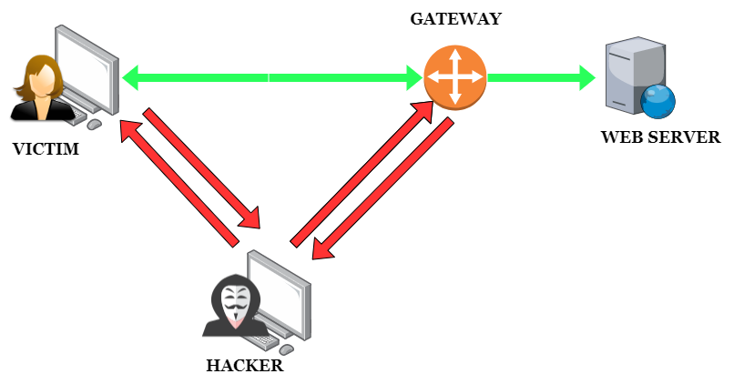
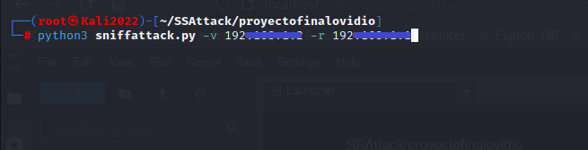
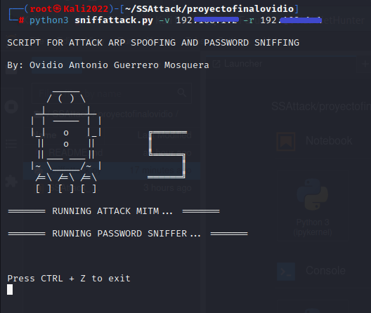
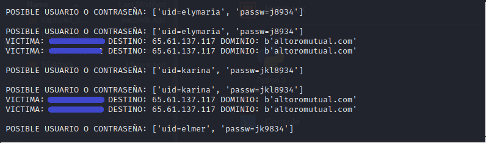
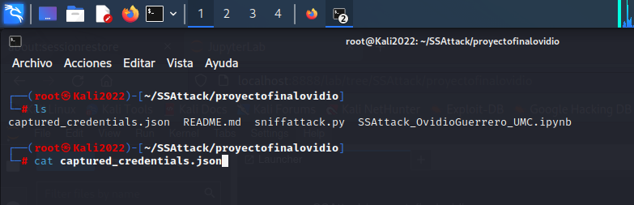
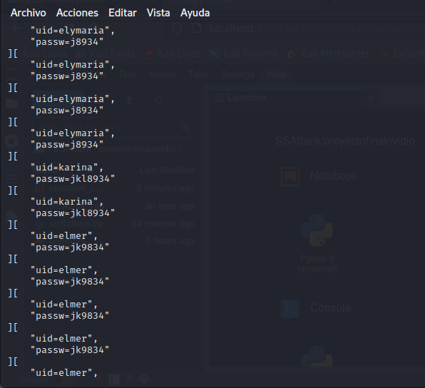

# SniffAttack

 ***Script to perform MiTM spoofing and sniffing attack on websites with http protocol.***

*Author: Ovidio Antonio Guerrero Mosquera*
 *Email: <ovanguemos@hotmail.com>* 
 

### Introduction To The MiTM Attack ###
In computer science, to execute a MiTM attack, the attacker needs to be "located" between two computers that are trying to communicate; impersonating one of them and intercepting the messages sent.

In the MiTM attack, the attacker impersonates the mac address of the gateway and the mac address of the user's computer, to make the victim's computer believe that the attacking computer is the gateway, and the gateway makes him believe that the attacking computer is the user's computer. In this way, it intercepts all the traffic between the user equipment and the gateway, and in this way captures the credentials entered in pages with http protocol.

  **Features**

* Code written in python3
* ARP spoofing
* Capture http requests
* Password sniffing

 **Instructions and navigation**

1. **git clone https://github.com/ovanguemos/SniffAttack.git**

2. **cd SSAttack/proyectofinalovidio**

3. **python3 sniffattack.py -h**  for see help 

 Options:

        -h, --help       show the help message and exit       [No required]
        -v, --victima    type the ip address of the victim    [Required]
        -r, --route      type the ip address of gateway       [Required]

 **Usage:** 

Being located in the tool directory, run the following command:

>**python3** sniffattack.py -v Ip_victim -r Ip_gateway

 ***Usage example:***

1. Type command:

 2. Running the tool:

 3. Console results:

 4. Capture credentials file path:

 5. Credential file review:

